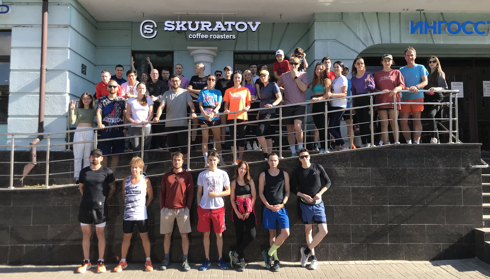

# SkuRunCoffeeBot_v2

Телеграм-бот для бегового клуба кофейни Скуратов в Казани.

Использована библиотека [aiogram](https://docs.aiogram.dev/en/dev-3.x/index.html).

## Команды

+ Работы с кодом ведётся из папки ./src/

      cd src

+ Подключение виртуальной среды для разработки

      make venv
      source venv/bin/activate

+ Запуск телеграм-бота:

      make run

+ Загрузка необходимых для работы бота модулей:

      make install_deps

+ Сохранение зависимостей в файл requirements.txt:

      make freeze_deps

+ Очистка проекта от файлов кеширования

      make clean

## Описание

Данные пользователей сохраняются в базе данных skurun.sql с помощью библиотеки sqlite3.

Заказы пользователей отправляются в google sheets с помощью подключения соответстующего API.

## Материалыб использованные в процессе написания кода

+ [habr.yakvenalex](https://habr.com/ru/users/yakvenalex/)

    + [Telegram Боты на Aiogram 3.x: Первые Шаги](https://habr.com/ru/companies/amvera/articles/820527/)

    + [Telegram Боты на Aiogram 3.x: Текстовая клавиатура и Командное меню](https://habr.com/ru/articles/820733/)

    + [Telegram Боты на Aiogram 3.x: Инлайн кнопки и CallBack Дата](https://habr.com/ru/articles/820877/)

    + [Telegram Боты на Aiogram 3.x: Магия фильтров](https://habr.com/ru/articles/821085/)

    + [Telegram Боты на Aiogram 3.x: Message handler и трюки с текстом](https://habr.com/ru/articles/821661/)

    + [Telegram Боты на Aiogram 3.x: Отправка и обработка медиа сообщений](https://habr.com/ru/articles/821961/)

    + [Telegram Боты на Aiogram 3.x: Все про FSM простыми словами](https://habr.com/ru/articles/822061/)

    + [Telegram Боты на Aiogram 3.x:  Интеграция с PostgreSQL в пару строк кода](https://habr.com/ru/articles/822083/)

    + [Telegram Боты на Aiogram 3.x: Профиль, админ-панель и реферальная система](https://habr.com/ru/articles/822809/)

